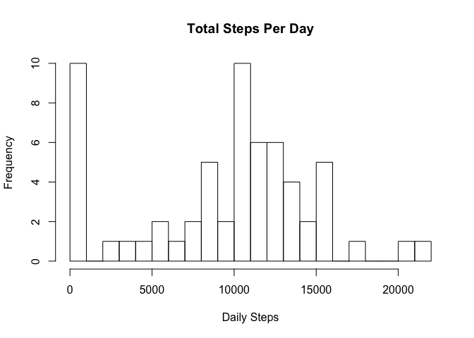
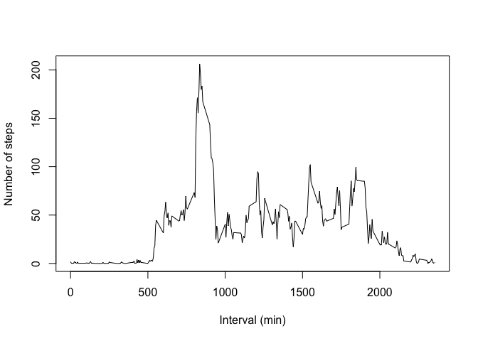
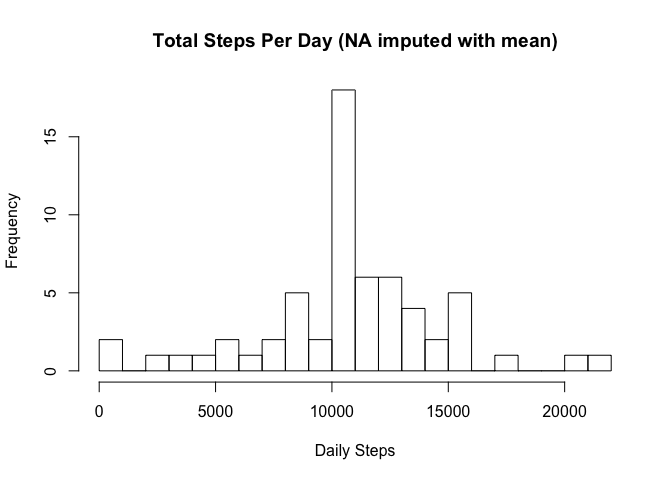
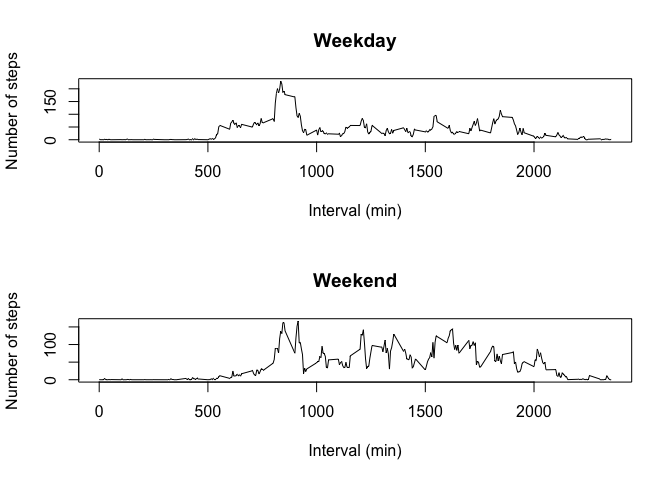

## Loading and preprocessing the data

```r
library(knitr)
library(data.table)
setwd("/Users/z/Coursera_courses/Data_Science_Spec/projects_and_books/5_Reproducible_Research/RepData_PeerAssessment1")
data <- read.csv("activity.csv")
data$date <- as.Date(data$date, format = "%Y-%m-%d")
data <- data.table(data)
```


## What is mean total number of steps taken per day?
### Histogram of total number of steps taken per day

```r
steps_total <- aggregate(data$steps, list(data$date), sum) #sum total steps by date and output a data.frame
steps_total <- data[, list(Steps = sum(steps, na.rm = TRUE)), by = c("date")]
hist(steps_total$Steps, breaks = seq(0, max(steps_total$Steps)+1000, 1000), main = "Total Steps Per Day", xlab = "Daily Steps")
```

<!-- -->


### Mean of total number of steps taken per day

```r
print(mean(steps_total$Steps))
```

```
## [1] 9354.23
```


### Median of total number of steps taken per day

```r
print(median(steps_total$Steps))
```

```
## [1] 10395
```


## What is the average daily activity pattern?
### Time series plot of the averaged steps for each 5-minute interval across all days

```r
time_series <- data[, list(Steps_average = mean(steps, na.rm = TRUE)), by = c("interval")] #average steps for each time interval
with(time_series, {
    plot(interval, Steps_average, xlab = 'Interval (min)', ylab = 'Number of steps', type = 'l')
})
```

<!-- -->


### The 5-minute interval with the highest step average

```r
print(time_series$interval[time_series$Steps_average == max(time_series$Steps_average)])
```

```
## [1] 835
```


## Imputing missing values
### Total number of missing values in the dataset

```r
print(sum(is.na(data$steps)))
```

```
## [1] 2304
```


### Imputing missing values with mean for that 5-min interval

```r
data[, Mean_steps := mean(steps, na.rm = TRUE), by = c("interval")] #add a new column of the mean number of steps at each interval
data_imputed <- data  #copy the original data.table
data_imputed$steps[is.na(data_imputed$steps)] <- data_imputed$Mean_steps[is.na(data_imputed$steps)] #replace all NA steps with the mean
```


### Make a historgram of daily total steps using the imputed data

```r
steps_total_imputed <- data_imputed[, list(Steps = sum(steps, na.rm = TRUE)), by = c("date")]
hist(steps_total_imputed$Steps, breaks = seq(0, max(steps_total$Steps)+1000, 1000), main = "Total Steps Per Day (NA imputed with mean)", xlab = "Daily Steps")
```

<!-- -->


### The mean of total steps per day after NAs were imputed by the mean averaged acrossed all dates.

```r
print(mean(steps_total_imputed$Steps))
```

```
## [1] 10766.19
```


### The median of total steps per day after NAs were imputed by the mean averaged acrossed all dates.

```r
print(median(steps_total_imputed$Steps))
```

```
## [1] 10766.19
```
### After imputing the NAs, the mean and median have the same value, and they are both higher than those from the first part of this assignment.


## Are there differences in activity patterns between weekdays and weekends?

```r
data_imputed[, day := as.factor(weekdays(date))]   #apply the base weekdays function
data_imputed[, week := ifelse(is.element(day, c("Saturday", "Sunday")), "weekend", "weekday" )] #add new column to specificy weekday vs weekend
data_imputed$week <- as.factor(data_imputed$week)  #cast to factor type
time_series_imputed <- data_imputed[, list(Steps_average = mean(steps, na.rm = TRUE)), by = c("interval", "week")] #average steps for each time interval and also by weekday vs weekend status
par(mfrow = c(2,1))
with(subset(time_series_imputed, week == "weekday"), {
    plot(interval, Steps_average, xlab = 'Interval (min)', ylab = 'Number of steps', main = "Weekday", type = 'l')
})
with(subset(time_series_imputed, week == "weekend"), {
    plot(interval, Steps_average, xlab = 'Interval (min)', ylab = 'Number of steps', main = "Weekend", type = 'l')
})
```

<!-- -->
